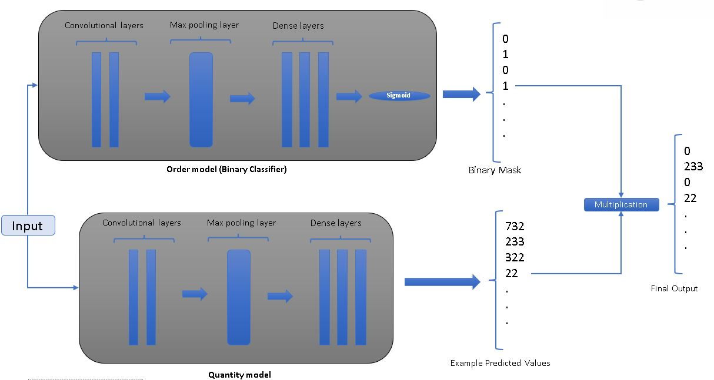

# Intermittent Time Series Prediction Model

## Overview

UR2CUTE : Using Repetitively 2 CNN for Unsteady Timeseries Estimation

This repository contains a Python-based machine learning model for time series prediction, designed explicitly for intermittent time series. It leverages TensorFlow and other data processing libraries for effective forecasting.
two models separately are being trained
a classifier to learn the intervals of the time-series
a regressor to learn the amount of the time-series

in both cases, a convolutional neural network is used with different loss functions ( one for classifier, one for regressor)
the classifier works as a mask with 1 and 0 that represent the existence of a demand, and it filters out the regressor output.

.
## Requirements
- Python 3.x
- Pandas
- TensorFlow
- NumPy
- scikit-learn


## Installation
Clone the repository and install the required packages.

## Usage

### Data Preparation
Your dataset should be in a Pandas DataFrame format with at least two columns: one for dates and one for the target variable (the quantity you want to predict). The date column should be in a format that Pandas can recognize as a date.

### Date frequency
It is assumed that the data has a weekly pattern, and for that reason, aggregate_weekly resample the data in a weekly manner
you can change it based on your data frequency or remove it.


### Model Training and Prediction
Import the model script and use the `ur2cute_split_deep` function to train the model and make predictions.
For the better results, it is recommended to use hyperparameter tunning techniques with Optuna or your method of choice. 

```python
import pandas as pd
from ur2cute_v2 import ur2cute_split_deep #or simply copy paste the function and libraries :)

# Load your data
# Ensure your data is in a pandas DataFrame with a date column and a target column
data = pd.read_csv('path_to_your_data.csv')

# Define the date column and the target column names
date_column = 'your_date_column_name'
target_column = 'your_target_column_name'

# Use the model function
# The function returns the predicted quantities
predicted_quantities = ur2cute_split_deep(data, date_column, target_column, lag_features=4, epochs=200, batch_size=32, val_patience=20, split_ratio=0.9, norm=False)

# Output the predictions
print(predicted_quantities)
```

## Contributing
Contributions to improve this model are welcome. Please submit pull requests or open an issue to discuss proposed changes.

